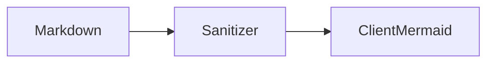

# With-Artifact Contract

Artifacts live in `<project>/.artifacts-manager/` and are cataloged by `manifest.json`.

## HTML topology contract

Use the exact runtimes below. Keep an HTML artifact standalone apart from these versioned CDN URLs.

```html
<script src="https://cdn.tailwindcss.com/3.4.17"></script>
<script type="module">
  import mermaid from 'https://cdn.jsdelivr.net/npm/mermaid@11.17.1/dist/mermaid.esm.min.mjs';
  mermaid.initialize({ startOnLoad: false, securityLevel: 'loose', theme: 'dark', flowchart: { htmlLabels: false } });
  await mermaid.run({ querySelector: '.mermaid' });
</script>
```

```html
<pre class="mermaid" data-mermaid-source="flowchart LR; Agent --> Manifest"><code>flowchart LR
  Agent --> Manifest</code></pre>
```

- Use Tailwind utilities for routine layout. Limit custom CSS to Mermaid sizing and exceptional visuals.
- Use Mermaid for graph-shaped diagrams. Decorative icons and quantitative charts may remain specialized visuals.
- Keep source in `pre.mermaid[data-mermaid-source]` so a failed CDN import or render remains readable.
- HTML inspector callbacks must be named, local, and allowlisted; Mermaid labels contain no arbitrary HTML.

## Markdown contract

Markdown Mermaid fences are rendered client-only by the manager with strict Mermaid security. The server sanitizes the complete marked HTML allowlist before insertion. Unsafe HTML, event handlers, unsafe URLs, and SVG are removed; malformed or unavailable diagrams retain escaped source and a generic alert.



Ordinary Markdown and non-Mermaid code fences remain ordinary content.

```mermaid
not a valid Mermaid diagram
```

The malformed diagram above must keep its source and show only a generic rendering alert.

## Manifest updates

Preserve each artifact `id`, `file`, and `createdAt`. Update only `updatedAt` and relevant lowercase tags such as `tailwind` and `mermaid`.
