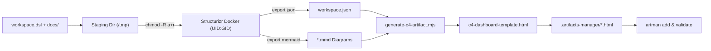

# Structurizr Artifact (C4 Architecture Dashboard Generator)

Use this skill whenever you need to visualize, share, or generate interactive C4 architecture diagrams from a project's `workspace.dsl`:
- **Full Architecture Dashboards:** Interactive single-file HTML dashboards with tab switching across System Context (L1), Containers (L2), and Components (L3).
- **Subsystem & Module Deep-Dives:** Filtered C4 dashboards focused on a specific container or subsystem (e.g. `BookingComponents`, `ViewerComponents`).
- **Visual Node Inspector:** Click any element to slide open an inspector panel displaying its technology stack, description, planned/external status, properties, and direct links to source code repositories.
- **Pan & Zoom Canvas:** Drag to pan, mouse wheel to zoom, with floating on-screen controls (`+`, `-`, `Fit`, `100%`) and keyboard shortcuts (`+`, `-`, `0`, `F`, `Esc`, `?`).

Artifacts are saved inside the target project under `.artifacts-manager/`, cataloged in `manifest.json`, validated with `artman validate`, and viewable at `https://artifacts.nimblersoft.com` or locally at `http://localhost:41820/project/<slug>/artifact/<artifact-id>`.

---

## 1. Quick Start

Run the generator script targeting the project directory:

```bash
# Generate full C4 architecture dashboard for a project
/home/ericmaster/tools/artifacts-manager/skills/structurizr-artifact/scripts/generate-c4-artifact.sh \
  --project /home/ericmaster/products/nimblerbot

# Generate a subsystem-specific dashboard (e.g. BookingComponents only)
/home/ericmaster/tools/artifacts-manager/skills/structurizr-artifact/scripts/generate-c4-artifact.sh \
  --project /home/ericmaster/products/nimblerbot \
  --views BookingComponents \
  --id booking-c4-model \
  --output booking-c4-model.html \
  --title "Nimblerbot Booking Engine — C4 Model"

# Validate workspace.dsl and exportability without creating files or modifying manifest
/home/ericmaster/tools/artifacts-manager/skills/structurizr-artifact/scripts/generate-c4-artifact.sh \
  --project /home/ericmaster/products/nimblerbot \
  --validate-only
```

---

## 2. CLI Options Reference

| Option | Default | Description |
|---|---|---|
| `--project <path>` | Current working directory | Path to repository root containing `workspace.dsl`. |
| `--output <filename>` | `architecture-model.html` | Destination HTML filename inside `.artifacts-manager/`. |
| `--id <artifact-id>` | `architecture-model` | Unique artifact identifier in `manifest.json`. |
| `--title <string>` | `[Workspace] C4 Architecture Model` | Custom title displayed in the dashboard header. |
| `--views <keys>` | All views in workspace | Comma-separated list of C4 view keys to include (e.g. `SystemContext,Containers`). |
| `--validate-only` | `false` | Verifies DSL syntax and diagram export without modifying files. |
| `-h, --help` | — | Display help information. |

---

## 3. Pipeline Architecture & Contracts

The generator script executes a 5-step compilation pipeline:



### Safety & Invariants:
1. **Isolated Staging & Zero Git Deletions:**
   Structurizr imports ADRs matching `\d{4}-.+?\.md`. Non-root container permissions (`UID 65532`) can fail on restricted files. Staging copies `workspace.dsl` and `docs/` to `/tmp/structurizr-stage-XXXXXX`, normalizes permissions to `0755` (`chmod -R a+r`), and mounts with `--user "$(id -u):$(id -g)"`. No tracked git files are ever modified or deleted.
2. **Authoritative AST Metadata:**
   All node metadata (names, descriptions, technologies, planned/external badges, properties, URLs) is extracted from Structurizr's authoritative `workspace.json` export—never heuristic text parsing.
3. **Strict Mermaid Security (`securityLevel: 'strict'`):**
   Raw `click` lines in exported Mermaid are stripped. Mermaid renders pure visual diagrams without `<foreignObject>` or link hijacks.
4. **DOM Event Delegation:**
   Clicks on diagram nodes (`g.node`) are captured via event delegation on `#diagram-canvas`, mapped via model ID `(/-flowchart-(\d+)-/)`, and slide open the Inspector panel.
5. **Artifacts Manager Validator Compliance:**
   - Exact Tailwind CSS CDN URL: `https://cdn.tailwindcss.com/3.4.17`
   - Exact Mermaid ESM CDN URL: `https://cdn.jsdelivr.net/npm/mermaid@11.17.1/dist/mermaid.esm.min.mjs`
    - Valid `<pre class="mermaid" data-mermaid-source="...">` fallbacks for every diagram tab.
    - Tags: `["architecture", "c4", "structurizr", "mermaid", "tailwind"]`.
6. **C4 Layout & Edge Scope:** The root overview keeps Users above internal Application/Data bands and External Connections below them with ELK and invisible ordering anchors. Generated `mermaidEdgeGroups` are filtered to the active expansion path so drilling into a subsystem does not redraw unrelated secondary relationships.

---

## 4. Viewing the Artifact

Once generated, view the artifact in Artifacts Manager:
- **Local Dev Server:**
  ```bash
  cd /home/ericmaster/tools/artifacts-manager && npm run dev
  # Open http://localhost:41820/project/<slug>/artifact/<artifact-id>
  ```
- **Production URL:**
  `https://artifacts.nimblersoft.com/project/<slug>/artifact/<artifact-id>`
